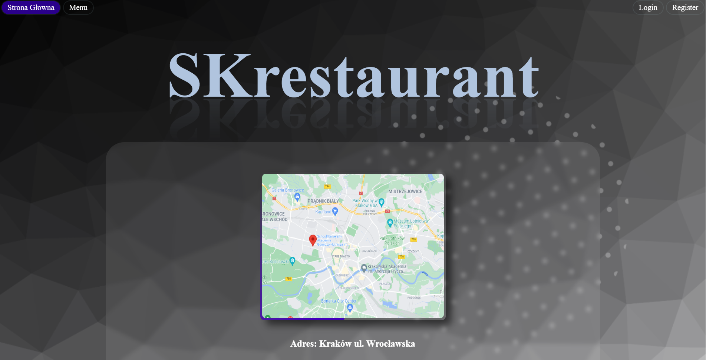

# --- Introduction-to-Web-Aplications ---

<h3>Description</h3>

Angular application with firebase database and authentication created from the scratch during one semester.

#

<h3> Technologies </h3>

- HTML
- CSS
- JavaScript
- TypeScript
- Angular
- Firebase
- Node.js

#

<h3>Tasks Content</h3> 

| Assignment |Description |
| ------------- | ------------- |
| [lab1]| Basic HTML + CSS (not mandatory)  |
| [lab2]| HTML + CSS  |
| [lab3]| HTML + CSS + JavaScript  |
| [lab4]| Angular introduction  |
| [lab5]| Angular advanced, firebase connection  |
| [lab6]| Angular + authentication handling + Firebase  |

#

<h3>Functionabilities:</h3>

 - guest: 
   - can watch menu
 - logged user:
   - same things as guest
   - can add meals to his basket
   - can see meal details
 - menager:
   - same things as logged user
   - can add new meal to menu
   - can edit meals
 - admin:
   - same things as menager
   - can manage every user role[user, menager, admin]
